# PHÂN TÍCH KIẾN TRÚC & QUY TRÌNH RUP
## Hệ thống Quản lý Khóa học Trực tuyến (E-Learning)

---

## PHẦN I: PHÂN TÍCH KIẾN TRÚC HỆ THỐNG

### 1. Kiến trúc tổng thể (System Architecture)

Hệ thống E-Learning được thiết kế theo **kiến trúc phân tầng (Layered Architecture)** kết hợp mô hình **Client-Server**, đảm bảo tính module hóa, dễ bảo trì và mở rộng.

#### 1.1. Sơ đồ Kiến trúc Phân tầng (Layered Architecture Diagram)

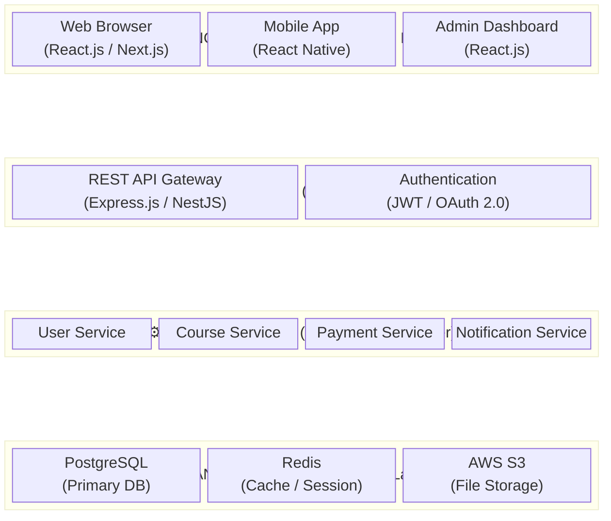

#### 1.2. Mô tả chi tiết các tầng

| Tầng | Vai trò | Công nghệ đề xuất |
|------|---------|-------------------|
| **Presentation Layer** | Giao diện người dùng, hiển thị dữ liệu, nhận tương tác | React.js / Next.js, Tailwind CSS |
| **API Gateway Layer** | Điểm truy cập duy nhất, xác thực, phân quyền, rate limiting | Express.js / NestJS, JWT |
| **Business Logic Layer** | Xử lý nghiệp vụ chính: đăng ký, thanh toán, học tập, thông báo | Node.js Services |
| **Data Access Layer** | Lưu trữ, truy vấn dữ liệu, caching, lưu trữ file | PostgreSQL, Redis, AWS S3 |

---

### 2. Sơ đồ Thành phần (Component Diagram)

Sơ đồ thành phần mô tả các module phần mềm chính và mối quan hệ phụ thuộc giữa chúng.

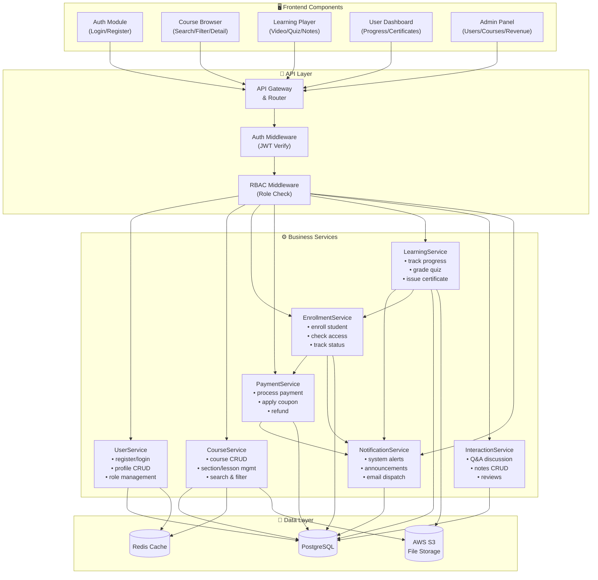

---

### 3. Sơ đồ Gói (Package Diagram)

Sơ đồ gói tổ chức các class đã phân tích thành các package logic, thể hiện cấu trúc module hóa của hệ thống.

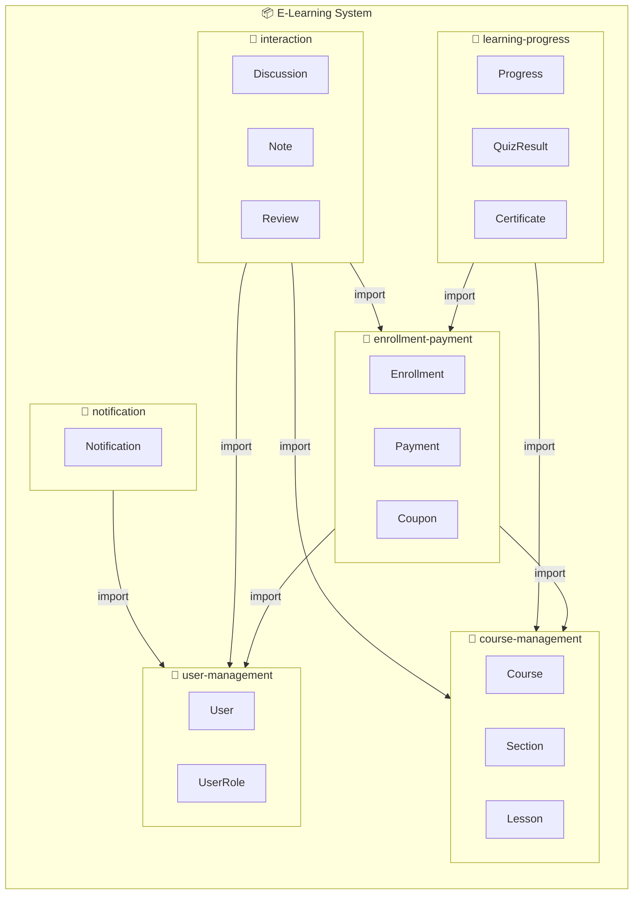

#### Mô tả các Package:

| Package | Chứa các Class | Mô tả |
|---------|----------------|--------|
| **user-management** | User, UserRole | Quản lý người dùng, xác thực, phân quyền đa vai trò |
| **course-management** | Course, Section, Lesson | Quản lý nội dung khóa học theo cấu trúc phân cấp |
| **enrollment-payment** | Enrollment, Payment, Coupon | Xử lý đăng ký, thanh toán, mã giảm giá |
| **learning-progress** | Progress, QuizResult, Certificate | Theo dõi tiến độ, kết quả kiểm tra, cấp chứng chỉ |
| **interaction** | Discussion, Note, Review | Tương tác học tập: Q&A, ghi chú, đánh giá |
| **notification** | Notification | Hệ thống thông báo (system, announcement) |

---

### 4. Sơ đồ Triển khai (Deployment Diagram)

Sơ đồ triển khai mô tả cách phân bổ các thành phần phần mềm trên hạ tầng vật lý/đám mây.

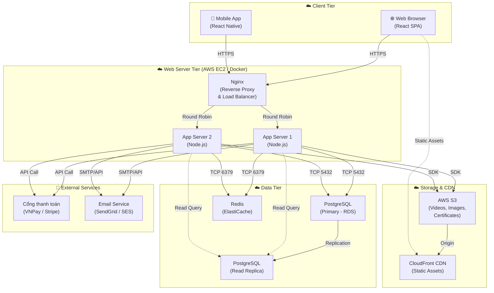

---

### 5. Sơ đồ Tuần tự (Sequence Diagrams) — Các luồng nghiệp vụ chính

#### 5.1. Luồng Đăng ký khóa học & Thanh toán

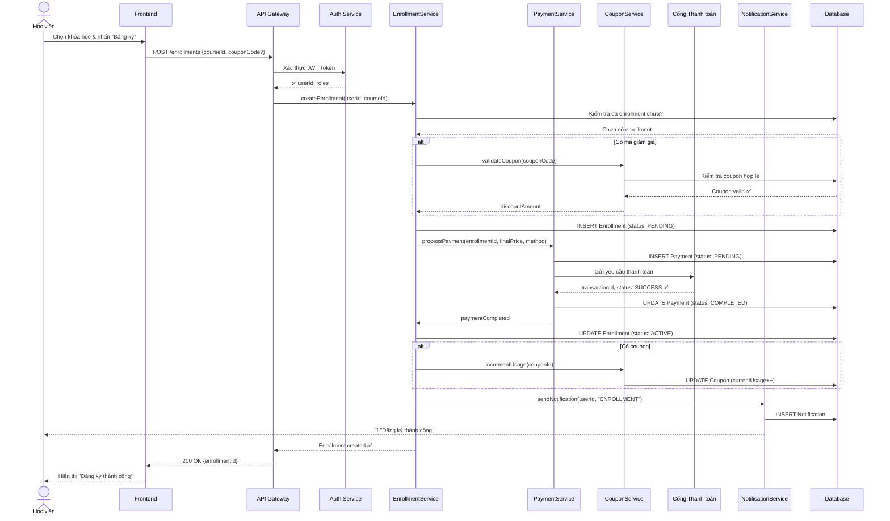

#### 5.2. Luồng Học bài & Theo dõi Tiến độ

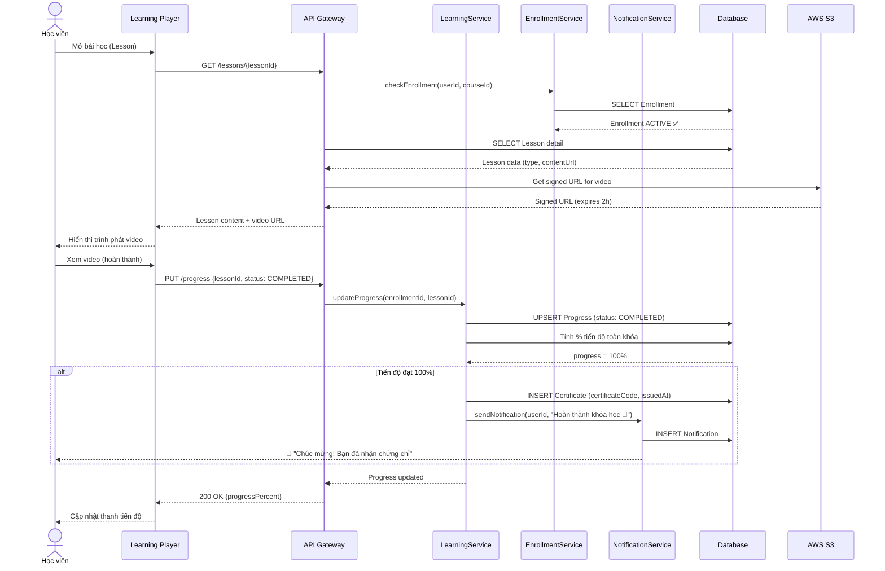

#### 5.3. Luồng Quản lý khóa học (Giảng viên)

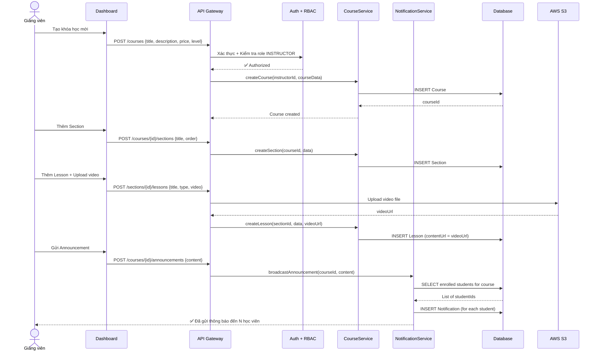

---

### 6. Sơ đồ Trạng thái (State Diagrams)

#### 6.1. Trạng thái của Enrollment

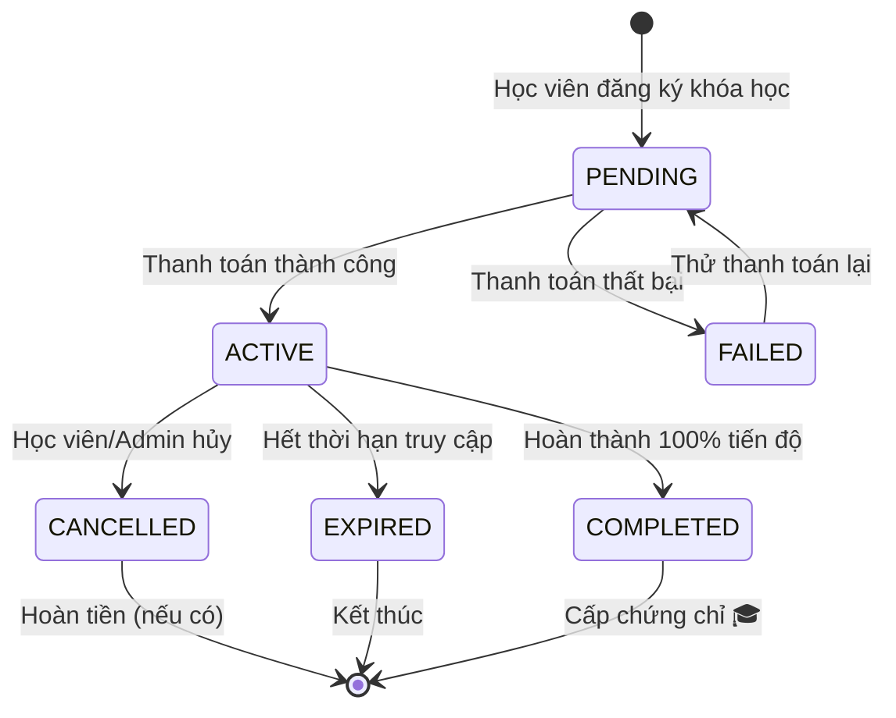

#### 6.2. Trạng thái của Payment

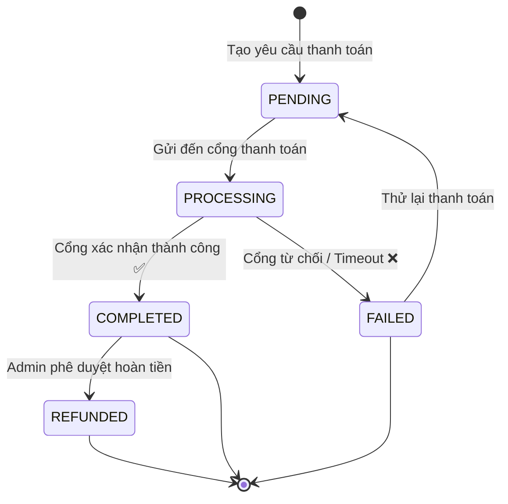

#### 6.3. Trạng thái của Progress (Tiến độ bài học)

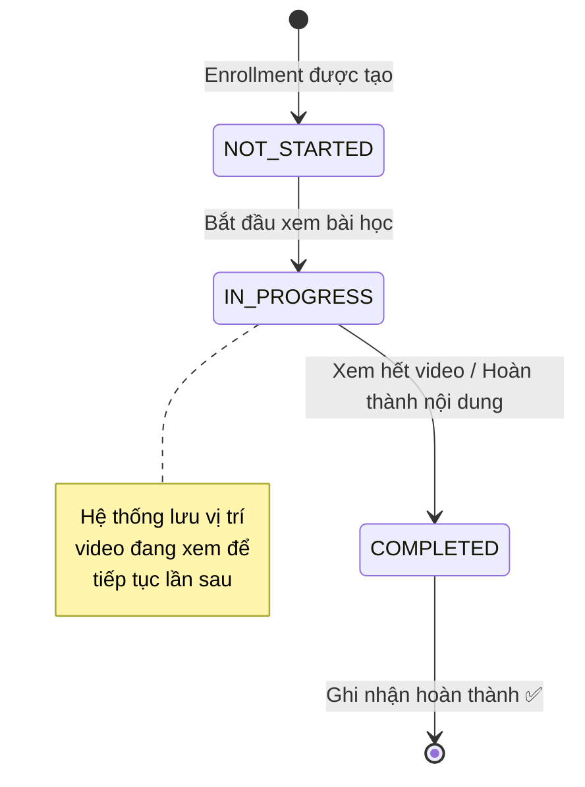

---

## PHẦN II: PHÂN TÍCH QUY TRÌNH RUP (Rational Unified Process)

### 1. Tổng quan về RUP

**RUP (Rational Unified Process)** là quy trình phát triển phần mềm lặp và tăng dần (iterative & incremental), hướng use-case, tập trung vào kiến trúc, và quản lý rủi ro. RUP chia vòng đời phát triển thành **4 pha**, mỗi pha gồm nhiều **vòng lặp (iterations)**.

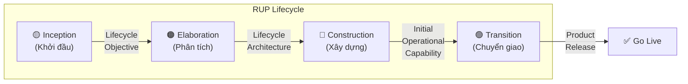

---

### 2. Áp dụng 4 Pha RUP cho Hệ thống E-Learning

#### 2.1. Pha Khởi đầu (Inception Phase)

**Mục tiêu:** Xác định phạm vi dự án, tầm nhìn, tính khả thi, và các rủi ro chính.

**Milestone:** Lifecycle Objective (LCO) — Các bên liên quan đồng ý về phạm vi và tầm nhìn dự án.

| Hoạt động | Sản phẩm đầu ra | Trạng thái |
|-----------|-----------------|------------|
| Xác định bối cảnh & mục tiêu | Tài liệu Vision (Tầm nhìn dự án) | ✅ Hoàn thành |
| Xác định các tác nhân (Actors) | 4 Actors: Guest, Student, Instructor, Admin | ✅ Hoàn thành |
| Phác thảo Use Case chính | 14 Use Cases đã xác định | ✅ Hoàn thành |
| Xác định yêu cầu phi chức năng | Bảo mật, hiệu suất, khả năng mở rộng | ✅ Hoàn thành |
| Đánh giá rủi ro ban đầu | Ma trận rủi ro (xem mục 4) | ✅ Hoàn thành |
| Lựa chọn công nghệ | Tech Stack: React + Node.js + PostgreSQL | ✅ Hoàn thành |
| Lập kế hoạch dự án | Lộ trình 3 giai đoạn (MVP → Full) | ✅ Hoàn thành |

**Iteration I1 (2 tuần):**
- Thu thập yêu cầu từ stakeholders
- Xây dựng tài liệu tổng quan dự án (`project_overview.md`)
- Phác thảo Use Case Diagram sơ bộ
- Đánh giá tính khả thi kỹ thuật và thương mại

---

#### 2.2. Pha Phân tích chi tiết (Elaboration Phase)

**Mục tiêu:** Phân tích yêu cầu chi tiết, thiết lập kiến trúc nền tảng (baseline architecture), giảm thiểu rủi ro kỹ thuật.

**Milestone:** Lifecycle Architecture (LCA) — Kiến trúc hệ thống đã được xác nhận và ổn định.

| Hoạt động | Sản phẩm đầu ra |
|-----------|-----------------|
| Phân tích chi tiết Use Case | Use Case Diagram hoàn chỉnh (14 UCs) |
| Thiết kế Class Diagram | 14 class entities với đầy đủ quan hệ |
| Thiết kế FDD | Biểu đồ phân cấp chức năng 5 phân hệ |
| Thiết kế DFD | DFD Mức 0 (Context) + DFD Mức 1 |
| Thiết kế kiến trúc phân tầng | 4-tier: Presentation → API → Business → Data |
| Thiết kế Component Diagram | 7 Business Services + data layer |
| Thiết kế Package Diagram | 6 packages: user, course, enrollment, learning, interaction, notification |
| Thiết kế Deployment Diagram | AWS-based: EC2 + RDS + S3 + CloudFront |
| Thiết kế Sequence Diagrams | 3 luồng chính: Enrollment, Learning, Course Mgmt |
| Thiết kế State Diagrams | 3 sơ đồ: Enrollment, Payment, Progress |
| Thiết kế Database Schema | ERD từ Class Diagram |
| Prototype UI/UX | Wireframe các màn hình chính |

**Iteration E1 (3 tuần):**
- Hoàn thiện phân tích Use Case (mô tả chi tiết luồng chính, luồng ngoại lệ)
- Thiết kế Class Diagram với các class cốt lõi: User, UserRole, Course, Section, Lesson, Enrollment
- Xây dựng FDD và DFD Mức 0
- Thiết kế và kiểm chứng kiến trúc phân tầng

**Iteration E2 (3 tuần):**
- Bổ sung Class cho Payment, Coupon, Notification
- Hoàn thiện DFD Mức 1
- Thiết kế Sequence Diagrams cho luồng thanh toán
- Xây dựng prototype kiến trúc (Architectural Proof-of-Concept)
- Thiết kế database schema và kiểm chứng với dữ liệu mẫu

---

#### 2.3. Pha Xây dựng (Construction Phase)

**Mục tiêu:** Phát triển toàn bộ chức năng hệ thống qua các vòng lặp tăng dần.

**Milestone:** Initial Operational Capability (IOC) — Hệ thống đã sẵn sàng để beta testing.

**Iteration C1 — Nền tảng & Xác thực (3 tuần):**

| Module | Chức năng | Priority |
|--------|-----------|----------|
| User Management | Đăng ký, Đăng nhập, JWT Auth | 🔴 Cao |
| UserRole | Phân quyền đa vai trò (STUDENT, INSTRUCTOR, ADMIN) | 🔴 Cao |
| Middleware | Auth Middleware, RBAC Middleware | 🔴 Cao |
| Database | Migration scripts, Seed data | 🔴 Cao |
| CI/CD | Pipeline cơ bản (lint, test, build) | 🟡 Trung bình |

**Iteration C2 — Quản lý Khóa học (3 tuần):**

| Module | Chức năng | Priority |
|--------|-----------|----------|
| Course CRUD | Tạo, sửa, xóa (soft delete), hiển thị khóa học | 🔴 Cao |
| Section/Lesson | Quản lý cấu trúc nội dung phân cấp | 🔴 Cao |
| File Upload | Upload video/hình ảnh lên S3 | 🔴 Cao |
| Search & Filter | Tìm kiếm khóa học theo tên, level, giá | 🟡 Trung bình |

**Iteration C3 — Đăng ký & Thanh toán (3 tuần):**

| Module | Chức năng | Priority |
|--------|-----------|----------|
| Enrollment | Đăng ký khóa học, kiểm tra trạng thái | 🔴 Cao |
| Payment | Tích hợp cổng thanh toán, xử lý giao dịch | 🔴 Cao |
| Coupon | Tạo, quản lý, áp dụng mã giảm giá | 🟡 Trung bình |
| Refund | Hoàn tiền qua Admin | 🟡 Trung bình |

**Iteration C4 — Học tập & Tương tác (3 tuần):**

| Module | Chức năng | Priority |
|--------|-----------|----------|
| Video Player | Trình phát video với tracking tiến độ | 🔴 Cao |
| Progress | Theo dõi tiến độ theo từng bài học | 🔴 Cao |
| Quiz | Làm bài kiểm tra, chấm điểm tự động | 🔴 Cao |
| Notes | Ghi chú tại timestamp video | 🟡 Trung bình |
| Discussion (Q&A) | Hỏi đáp lồng nhau dưới bài học | 🟡 Trung bình |

**Iteration C5 — Nâng cao & Hoàn thiện (3 tuần):**

| Module | Chức năng | Priority |
|--------|-----------|----------|
| Certificate | Tự động cấp chứng chỉ khi hoàn thành | 🟡 Trung bình |
| Review | Đánh giá khóa học (ràng buộc Enrollment) | 🟡 Trung bình |
| Notification | Thông báo hệ thống + Announcements | 🟡 Trung bình |
| Admin Dashboard | Thống kê doanh thu, quản lý user, coupon | 🟡 Trung bình |
| Soft Delete | Xóa mềm User, Course, Discussion | 🟢 Thấp |
| Audit Trail | createdAt, updatedAt tự động | 🟢 Thấp |

---

#### 2.4. Pha Chuyển giao (Transition Phase)

**Mục tiêu:** Triển khai hệ thống cho người dùng cuối, đào tạo, và bàn giao.

**Milestone:** Product Release — Hệ thống chính thức vận hành.

**Iteration T1 — Beta & UAT (2 tuần):**

| Hoạt động | Mô tả |
|-----------|-------|
| Beta Testing | Mời nhóm người dùng thử nghiệm (50-100 users) |
| UAT (User Acceptance Testing) | Kiểm thử chấp nhận với stakeholders |
| Performance Testing | Load test 500 concurrent users |
| Security Audit | Kiểm tra OWASP Top 10, SQL Injection, XSS |
| Bug Fixing | Sửa lỗi từ phản hồi beta testing |

**Iteration T2 — Go-Live (2 tuần):**

| Hoạt động | Mô tả |
|-----------|-------|
| Production Deployment | Triển khai lên AWS (EC2 + RDS + S3 + CloudFront) |
| Data Migration | Chuyển dữ liệu từ staging sang production |
| User Training | Đào tạo Admin và Instructor sử dụng hệ thống |
| Documentation | Hoàn thiện user manual và API documentation |
| Monitoring Setup | Thiết lập logging, alerting, health checks |
| Post-Go-Live Support | Hỗ trợ kỹ thuật 2 tuần sau go-live |

---

### 3. Ma trận Luồng công việc RUP × Pha (RUP Disciplines vs Phases)

Bảng dưới thể hiện cường độ hoạt động của từng luồng công việc (workflow/discipline) trong mỗi pha RUP:

```
                        Inception   Elaboration   Construction   Transition
                        ─────────   ───────────   ────────────   ──────────
Business Modeling       ████████░     ███░░░░░░     ░░░░░░░░░     ░░░░░░░░░
Requirements            ██████░░░     █████████     ███░░░░░░     █░░░░░░░░
Analysis & Design       ██░░░░░░░     █████████     █████░░░░     ░░░░░░░░░
Implementation          ░░░░░░░░░     ███░░░░░░     █████████     ██░░░░░░░
Testing                 ░░░░░░░░░     ██░░░░░░░     ██████░░░     █████████
Deployment              ░░░░░░░░░     ░░░░░░░░░     █░░░░░░░░     █████████
Config & Change Mgmt    █░░░░░░░░     ██░░░░░░░     █████░░░░     ███░░░░░░
Project Management      ████░░░░░     ███░░░░░░     █████░░░░     ███░░░░░░
Environment             ███░░░░░░     ████░░░░░     ██░░░░░░░     █░░░░░░░░
```

#### Giải thích áp dụng cho dự án E-Learning:

| Luồng công việc | Mô tả áp dụng |
|-----------------|----------------|
| **Business Modeling** | Mô hình hóa nghiệp vụ e-learning: quy trình đăng ký-thanh toán-học tập. Tập trung ở Inception. |
| **Requirements** | Thu thập yêu cầu, xác định Use Cases. Cao nhất ở Elaboration khi phân tích chi tiết 14 UCs. |
| **Analysis & Design** | Thiết kế Class Diagram, FDD, DFD, Sequence, State, Architecture. Đỉnh ở Elaboration. |
| **Implementation** | Coding 7 service modules. Chiếm phần lớn ở Construction (5 iterations). |
| **Testing** | Unit test, Integration test, UAT. Tăng dần và đạt đỉnh ở Transition. |
| **Deployment** | Triển khai staging → production. Tập trung ở Transition. |
| **Config & Change Mgmt** | Git workflow, CI/CD, version control. Duy trì đều từ Elaboration → Construction. |
| **Project Management** | Lập kế hoạch, theo dõi tiến độ, quản lý rủi ro. Xuyên suốt 4 pha. |
| **Environment** | Thiết lập môi trường dev, staging, production. Sớm ở Inception & Elaboration. |

---

### 4. Quản lý Rủi ro (Risk Management)

#### 4.1. Ma trận rủi ro

| # | Rủi ro | Xác suất | Tác động | Mức độ | Chiến lược giảm thiểu |
|---|--------|----------|----------|--------|----------------------|
| R1 | Tích hợp cổng thanh toán gặp lỗi | Cao | Cao | 🔴 Nghiêm trọng | Prototype tích hợp sớm ở Elaboration E2; sử dụng Sandbox mode |
| R2 | Hiệu năng streaming video kém | Cao | Cao | 🔴 Nghiêm trọng | Sử dụng CDN (CloudFront) + Signed URLs; load test sớm |
| R3 | Bảo mật dữ liệu người dùng | Trung bình | Cao | 🟠 Cao | JWT + bcrypt + HTTPS; Security audit ở Transition |
| R4 | Database bottleneck khi scale | Trung bình | Cao | 🟠 Cao | Read Replica + Redis caching; index optimization |
| R5 | Yêu cầu thay đổi giữa chừng | Cao | Trung bình | 🟠 Cao | Quy trình RUP iterative cho phép điều chỉnh linh hoạt |
| R6 | Thiếu kinh nghiệm team với tech stack | Trung bình | Trung bình | 🟡 Trung bình | Training 1 tuần ở Inception; pair programming |
| R7 | Deadline bị trễ | Trung bình | Trung bình | 🟡 Trung bình | Buffer 20% thời gian; theo dõi velocity mỗi iteration |

#### 4.2. Lịch trình tổng thể dự án

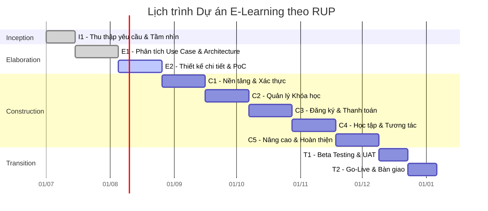

**Tổng thời gian ước tính:** ~26 tuần (~6.5 tháng)

---

### 5. Ánh xạ Use Case → RUP Iteration

Bảng ánh xạ cho thấy mỗi Use Case được phân tích, thiết kế, và triển khai ở vòng lặp nào:

| Use Case | Elaboration | Construction | Testing |
|----------|-------------|--------------|---------|
| UC1: Đăng ký/Đăng nhập | E1 | **C1** | T1 |
| UC2: Tìm kiếm & Xem khóa học | E1 | **C2** | T1 |
| UC3: Đăng ký & Thanh toán | E2 | **C3** | T1 |
| UC3a: Áp dụng Coupon | E2 | **C3** | T1 |
| UC4: Học & Ghi chú (Notes) | E1, E2 | **C4** | T1 |
| UC5: Thảo luận (Q&A) | E2 | **C4** | T1 |
| UC6: Làm kiểm tra (Quiz) | E1 | **C4** | T1 |
| UC7: Đánh giá & Chứng chỉ | E2 | **C5** | T1 |
| UC7a: Nhận thông báo | E2 | **C5** | T1 |
| UC8: Quản lý khóa học | E1 | **C2** | T1 |
| UC9: Quản lý nội dung | E1 | **C2** | T1 |
| UC10: Giải đáp Q&A | E2 | **C4** | T1 |
| UC11: Gửi Announcements | E2 | **C5** | T1 |
| UC11a: Xem thống kê doanh thu | E2 | **C5** | T1 |
| UC12: Quản lý người dùng & Phân quyền | E1 | **C1** | T1 |
| UC13: Quản lý thanh toán & Coupon | E2 | **C3, C5** | T1 |
| UC14: Quản lý doanh thu hệ thống | E2 | **C5** | T1 |

---

### 6. Yêu cầu phi chức năng (Non-Functional Requirements)

| Loại | Yêu cầu | Mục tiêu |
|------|---------|----------|
| **Hiệu năng** | Thời gian phản hồi API | < 200ms cho 95% requests |
| **Hiệu năng** | Concurrent users | Hỗ trợ ≥ 500 users đồng thời |
| **Khả dụng** | Uptime | ≥ 99.5% (SLA) |
| **Bảo mật** | Authentication | JWT + Refresh Token (hết hạn 15 phút) |
| **Bảo mật** | Password | bcrypt hash (salt rounds = 12) |
| **Bảo mật** | API | Rate limiting: 100 req/min/user |
| **Bảo mật** | Data | HTTPS (TLS 1.3), encrypted at rest |
| **Mở rộng** | Horizontal scaling | Stateless API → dễ dàng thêm instance |
| **Mở rộng** | Database | Read Replica cho queries nặng |
| **Bảo trì** | Code quality | ESLint + Prettier, min 80% test coverage |
| **Bảo trì** | Logging | Structured logging (JSON), centralized (ELK Stack) |
| **Tương thích** | Browser | Chrome, Firefox, Safari, Edge (2 phiên bản mới nhất) |
| **Tương thích** | Mobile | Responsive design (≥ 320px width) |

---

### 7. Tổng kết tài liệu phân tích

#### Danh sách sản phẩm phân tích đã hoàn thành:

| # | Sản phẩm | File | Trạng thái |
|---|----------|------|------------|
| 1 | Tài liệu tổng quan dự án | `project_overview.md` | ✅ |
| 2 | Use Case Diagram + Mô tả | `system_analysis.md` | ✅ |
| 3 | Class Diagram (14 entities) | `system_analysis.md` | ✅ |
| 4 | FDD (Functional Decomposition) | `dfd_fdd_analysis.md` | ✅ |
| 5 | DFD Mức 0 + Mức 1 | `dfd_fdd_analysis.md` | ✅ |
| 6 | Kiến trúc phân tầng | `architecture_rup_analysis.md` | ✅ |
| 7 | Component Diagram | `architecture_rup_analysis.md` | ✅ |
| 8 | Package Diagram | `architecture_rup_analysis.md` | ✅ |
| 9 | Deployment Diagram | `architecture_rup_analysis.md` | ✅ |
| 10 | Sequence Diagrams (3 luồng) | `architecture_rup_analysis.md` | ✅ |
| 11 | State Diagrams (3 sơ đồ) | `architecture_rup_analysis.md` | ✅ |
| 12 | Quy trình RUP (4 pha, 9 iterations) | `architecture_rup_analysis.md` | ✅ |
| 13 | Ma trận RUP Disciplines × Phases | `architecture_rup_analysis.md` | ✅ |
| 14 | Quản lý rủi ro | `architecture_rup_analysis.md` | ✅ |
| 15 | Gantt Chart lịch trình | `architecture_rup_analysis.md` | ✅ |
| 16 | Yêu cầu phi chức năng | `architecture_rup_analysis.md` | ✅ |
