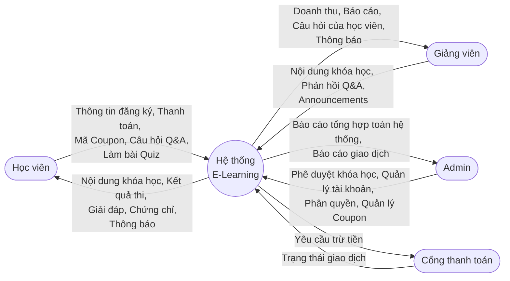
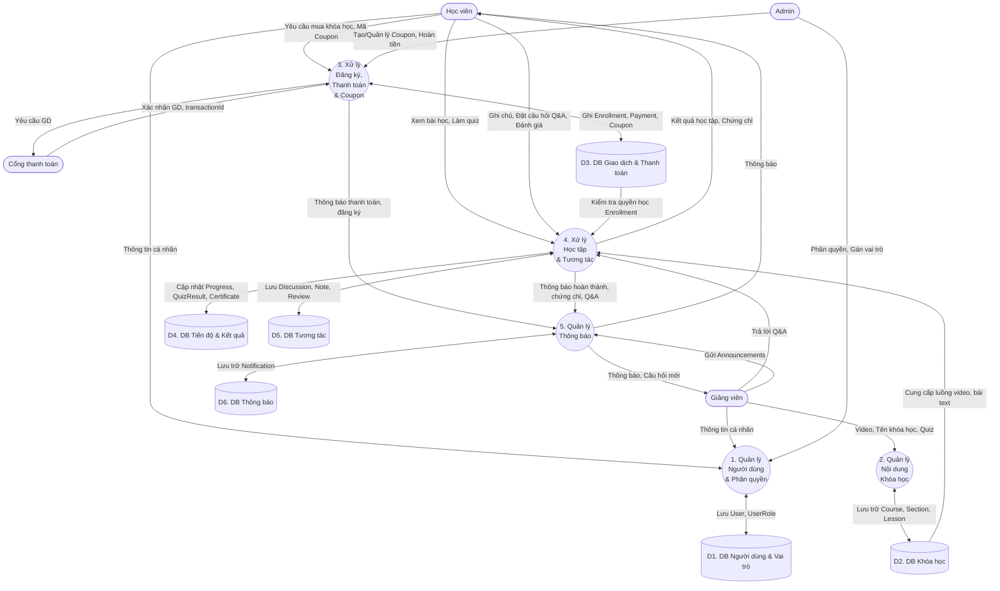

# PHÂN TÍCH HỆ THỐNG: BIỂU ĐỒ FDD VÀ DFD

Dựa trên các chức năng đã chốt (Giữ Q&A, Notes, Chứng chỉ; Bổ sung Payment, Coupon, Notification, đa vai trò, Soft Delete & Audit Trail), dưới đây là các biểu đồ thiết kế phân cấp chức năng (FDD) và biểu đồ luồng dữ liệu (DFD).

## 1. Biểu đồ Phân cấp Chức năng - FDD (Functional Decomposition Diagram)

Biểu đồ FDD chia nhỏ hệ thống tổng thể thành các phân hệ và chức năng chi tiết, giúp đội ngũ phát triển dễ dàng hình dung cấu trúc module của hệ thống.

```mermaid
graph TD
    SYS[Hệ thống Quản lý E-Learning]
    
    SYS --> F1[1. Quản lý người dùng]
    F1 --> F1_1[1.1 Đăng ký & Đăng nhập]
    F1 --> F1_2[1.2 Quản lý hồ sơ cá nhân]
    F1 --> F1_3["1.3 Phân quyền đa vai trò (UserRole)"]
    F1 --> F1_4["1.4 Xóa mềm tài khoản (Soft Delete)"]
    
    SYS --> F2[2. Quản lý khóa học]
    F2 --> F2_1[2.1 Tạo & Cập nhật khóa học]
    F2 --> F2_2[2.2 Quản lý Section & Lesson]
    F2 --> F2_3[2.3 Kiểm duyệt nội dung]
    F2 --> F2_4["2.4 Xóa mềm khóa học (Soft Delete)"]
    
    SYS --> F3[3. Hoạt động học tập]
    F3 --> F3_1[3.1 Tìm kiếm & Lọc khóa học]
    F3 --> F3_2[3.2 Đăng ký khóa học]
    F3 --> F3_3["3.3 Thanh toán (Payment)"]
    F3 --> F3_4["Áp dụng mã giảm giá (Coupon)"]
    F3 --> F3_5[3.5 Trình phát Video & Theo dõi tiến độ]
    F3 --> F3_6[3.6 Làm bài kiểm tra Quiz]
    F3 --> F3_7[3.7 Cấp phát chứng chỉ]
    
    SYS --> F4[4. Tương tác hệ thống]
    F4 --> F4_1[4.1 Hỏi đáp & Thảo luận Q&A]
    F4 --> F4_2[4.2 Tạo ghi chú bài học Notes]
    F4 --> F4_3["Đánh giá & Review (ràng buộc Enrollment)"]
    F4 --> F4_4["4.4 Thông báo (Notification)"]
    
    SYS --> F5[5. Quản trị & Báo cáo]
    F5 --> F5_1[5.1 Thống kê doanh thu]
    F5 --> F5_2[5.2 Thống kê số lượng học viên]
    F5 --> F5_3["5.3 Quản lý Coupon"]
    F5 --> F5_4["5.4 Quản lý giao dịch thanh toán"]
```

---

## 2. Biểu đồ Luồng dữ liệu - DFD (Data Flow Diagram)

### 2.1. Biểu đồ Ngữ cảnh (DFD Mức 0 - Context Diagram)
Mô tả cái nhìn tổng quan nhất về sự trao đổi dữ liệu giữa Hệ thống và các Tác nhân (Entities) bên ngoài.

### 2.2. Biểu đồ Luồng dữ liệu Mức 1 (DFD Level 1)
Phân rã Hệ thống E-Learning ở mức 0 thành các "Tiến trình" (Processes) cốt lõi và các "Kho dữ liệu" (Data Stores) để thấy rõ luồng đi của dữ liệu.

### Chú thích các kho dữ liệu (Data Stores) trong DFD Mức 1:
- **D1. DB Người dùng & Vai trò:** Chứa dữ liệu của `User` và `UserRole` (đa vai trò). Hỗ trợ Soft Delete và Audit Trail.
- **D2. DB Khóa học:** Chứa dữ liệu của các class `Course`, `Section`, `Lesson`. Hỗ trợ Soft Delete cho Course.
- **D3. DB Giao dịch & Thanh toán:** Chứa dữ liệu của `Enrollment`, `Payment` (tách riêng) và `Coupon` (mã giảm giá) ⭐.
- **D4. DB Tiến độ & Kết quả:** Chứa dữ liệu của `Progress`, `QuizResult`, `Certificate`.
- **D5. DB Tương tác:** Chứa dữ liệu của `Discussion`, `Note`, `Review` (ràng buộc với Enrollment).
- **D6. DB Thông báo ⭐:** Chứa dữ liệu của `Notification` (thông báo hệ thống và Announcements).
