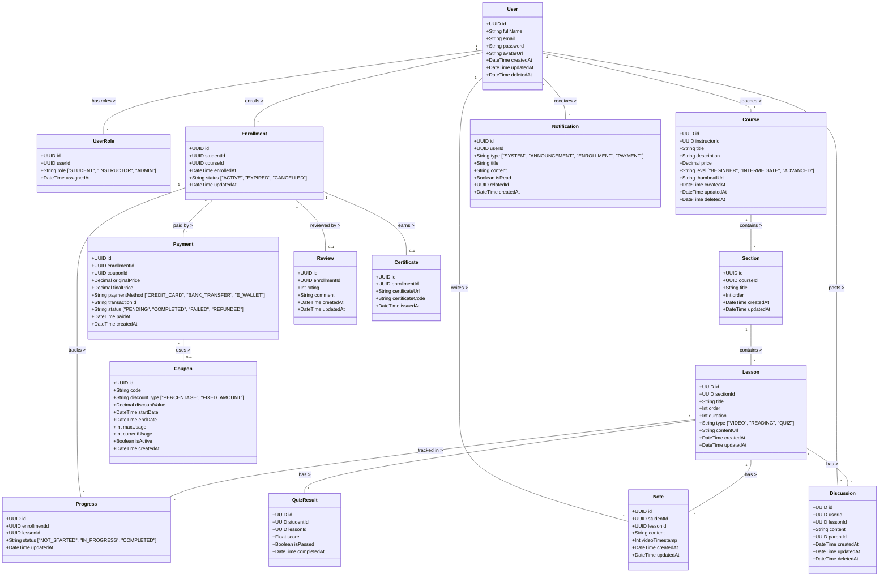

# PHÂN TÍCH HỆ THỐNG: USE CASE & CLASS DIAGRAM

Dựa trên yêu cầu hệ thống quản lý khóa học trực tuyến (E-Learning) quy mô vừa và nhỏ, dưới đây là phân tích chi tiết về Use Case và sơ đồ Class Diagram đã được cập nhật với các cải tiến: hỗ trợ đa vai trò, tách riêng Payment, thêm Coupon, Notification, Soft Delete & Audit Trail, và ràng buộc Review với Enrollment.

## 1. Phân tích Use Case (Cập nhật)

### 1.1. Các Tác nhân (Actors)
1. **Khách (Guest):** Người chưa đăng nhập, có thể xem danh sách và chi tiết khóa học.
2. **Học viên (Student):** Người dùng tham gia vào các khóa học, thực hành bài tập và tương tác.
3. **Giảng viên (Instructor):** Người tạo nội dung khóa học, chấm điểm và hỗ trợ học viên.
4. **Quản trị viên (Admin):** Người điều hành và quản lý toàn bộ hệ thống.

### 1.2. Sơ đồ Use Case (Use Case Diagram)

```mermaid
usecaseDiagram
    actor Khách as "Khách (Guest)"
    actor Học_viên as "Học viên (Student)"
    actor Giảng_viên as "Giảng viên (Instructor)"
    actor Quản_trị_viên as "Quản trị (Admin)"
    
    Khách <|-- Học_viên
    Khách <|-- Giảng_viên
    
    package "Hệ thống E-Learning" {
        usecase "Đăng ký/Đăng nhập" as UC1
        usecase "Tìm kiếm & Xem khóa học" as UC2
        
        %% Học viên
        usecase "Đăng ký & Thanh toán" as UC3
        usecase "Áp dụng mã giảm giá (Coupon)" as UC3a
        usecase "Học & Ghi chú (Notes)" as UC4
        usecase "Thảo luận (Q&A)" as UC5
        usecase "Làm kiểm tra (Quiz)" as UC6
        usecase "Đánh giá & Nhận chứng chỉ" as UC7
        usecase "Nhận thông báo" as UC7a
        
        %% Giảng viên
        usecase "Quản lý khóa học (Tạo/Sửa/Xóa)" as UC8
        usecase "Quản lý nội dung (Video, Quiz)" as UC9
        usecase "Giải đáp Q&A" as UC10
        usecase "Gửi thông báo (Announcements)" as UC11
        usecase "Xem thống kê doanh thu" as UC11a
        
        %% Admin
        usecase "Quản lý người dùng & Phân quyền" as UC12
        usecase "Quản lý thanh toán & Coupon" as UC13
        usecase "Quản lý doanh thu hệ thống" as UC14
    }
    
    Khách --> UC1
    Khách --> UC2
    
    Học_viên --> UC3
    Học_viên --> UC3a
    Học_viên --> UC4
    Học_viên --> UC5
    Học_viên --> UC6
    Học_viên --> UC7
    Học_viên --> UC7a
    
    Giảng_viên --> UC8
    Giảng_viên --> UC9
    Giảng_viên --> UC10
    Giảng_viên --> UC11
    Giảng_viên --> UC11a
    Giảng_viên --> UC7a
    
    Quản_trị_viên --> UC12
    Quản_trị_viên --> UC13
    Quản_trị_viên --> UC14
    
    UC3 ..> UC3a : <<extend>>
```

### 1.3. Mô tả chi tiết các Use Case (Cập nhật)
- **Ghi chú bài học (Notes - Học viên):** Cho phép học viên ghi chú lại tại một thời điểm cụ thể của video bài giảng để ôn tập dễ dàng hơn.
- **Thảo luận (Q&A - Học viên & Giảng viên):** Học viên có thể đặt câu hỏi ngay dưới mỗi Lesson. Giảng viên nhận thông báo và vào giải đáp. Tăng tính tương tác thay vì chỉ học một chiều.
- **Nhận chứng chỉ (Certificate - Học viên):** Tự động sinh chứng chỉ (PDF hoặc Image) khi học viên đạt 100% tiến độ và vượt qua bài kiểm tra cuối khóa.
- **Áp dụng mã giảm giá (Coupon - Học viên) ⭐:** Học viên có thể nhập mã giảm giá khi thanh toán khóa học. Hệ thống tự động kiểm tra tính hợp lệ, tính giá sau giảm và ghi nhận vào bản ghi Payment.
- **Nhận thông báo (Notification - Học viên & Giảng viên) ⭐:** Người dùng nhận thông báo tự động từ hệ thống (thanh toán, hoàn thành khóa học...) và thông báo từ giảng viên (Announcements).
- **Gửi thông báo (Announcements - Giảng viên) ⭐:** Giảng viên có thể gửi thông báo cập nhật khóa học đồng loạt đến các học viên đang đăng ký khóa đó.
- **Quản lý thanh toán & Coupon (Admin) ⭐:** Admin quản lý toàn bộ giao dịch thanh toán, hoàn tiền, tạo/quản lý mã giảm giá.
- **Phân quyền đa vai trò (Admin) ⭐:** Admin có thể gán nhiều vai trò cho một người dùng (ví dụ: vừa là Student vừa là Instructor).

---

## 2. Phân tích Lớp đối tượng (Class Diagram - Cập nhật)

Các lớp đã được cập nhật và bổ sung bao gồm: `UserRole`, `Payment`, `Coupon`, `Notification`, `Note`, `Discussion`, `Certificate`. Tất cả các thực thể chính đều có trường `createdAt`, `updatedAt` (Audit Trail) và `deletedAt` (Soft Delete).

### 2.1. Sơ đồ Lớp (Class Diagram)



### 2.2. Chi tiết các thực thể (Cập nhật)

#### Thực thể cốt lõi
1. **User (Người dùng):** Thông tin cơ bản của người dùng. Không còn lưu `role` trực tiếp, thay vào đó sử dụng bảng `UserRole` để hỗ trợ đa vai trò. Hỗ trợ Soft Delete qua `deletedAt`.
2. **UserRole (Vai trò người dùng) ⭐:** Bảng trung gian quản lý mối quan hệ nhiều-nhiều giữa User và các vai trò (STUDENT, INSTRUCTOR, ADMIN). Một người dùng có thể vừa là Student vừa là Instructor.
3. **Course (Khóa học):** Bổ sung `thumbnailUrl`, `updatedAt`, `deletedAt` cho Soft Delete.
4. **Section / Lesson:** Bổ sung `createdAt`, `updatedAt` cho Audit Trail.

#### Thực thể giao dịch
5. **Enrollment (Đăng ký):** Chỉ lưu thông tin đăng ký và trạng thái (ACTIVE/EXPIRED/CANCELLED). Thông tin thanh toán được tách sang bảng `Payment`.
6. **Payment (Thanh toán) ⭐:** Bảng riêng lưu trữ chi tiết giao dịch: số tiền gốc, số tiền thực trả, phương thức thanh toán, mã giao dịch từ cổng thanh toán, trạng thái (PENDING/COMPLETED/FAILED/REFUNDED).
7. **Coupon (Mã giảm giá) ⭐:** Quản lý mã giảm giá với loại giảm (PERCENTAGE/FIXED_AMOUNT), thời gian hiệu lực, giới hạn số lần sử dụng. Liên kết với `Payment` khi học viên áp dụng mã.

#### Thực thể học tập
8. **Progress (Tiến độ):** Bổ sung `updatedAt` để theo dõi thời điểm cập nhật tiến độ gần nhất.
9. **QuizResult (Kết quả quiz):** Bổ sung `completedAt`.
10. **Review (Đánh giá):** **Liên kết qua `enrollmentId` thay vì `studentId` + `courseId`** — đảm bảo chỉ học viên đã đăng ký mới được đánh giá. Mỗi Enrollment chỉ có tối đa 1 Review (UNIQUE constraint).

#### Thực thể tương tác
11. **Note (Ghi chú):** Lưu ghi chú cá nhân của Học viên. `videoTimestamp` lưu số giây hiện tại của video để khi bấm vào ghi chú, video sẽ tua đúng đến đoạn đó. Bổ sung `updatedAt`.
12. **Discussion (Q&A/Thảo luận):** Hệ thống hỏi đáp ngay trong bài học. Trường `parentId` cho phép tổ chức theo dạng bình luận lồng nhau (Reply). Hỗ trợ Soft Delete qua `deletedAt`.
13. **Certificate (Chứng chỉ):** Cấp tự động dựa trên điều kiện tiến độ hoàn thành 100%. Liên kết qua `enrollmentId`. Bổ sung `certificateCode` duy nhất để xác thực.
14. **Notification (Thông báo) ⭐:** Lưu thông báo gửi đến người dùng. Hỗ trợ nhiều loại: SYSTEM (tự động), ANNOUNCEMENT (từ giảng viên), ENROLLMENT, PAYMENT. Trường `relatedId` cho phép liên kết đến đối tượng liên quan (courseId, enrollmentId...). `isRead` theo dõi trạng thái đọc.

### 2.3. Quy tắc Soft Delete & Audit Trail
- **Soft Delete:** Các thực thể `User`, `Course`, `Discussion` hỗ trợ xóa mềm qua trường `deletedAt`. Khi xóa, hệ thống cập nhật `deletedAt = NOW()` thay vì xóa vĩnh viễn khỏi database.
- **Audit Trail:** Tất cả các thực thể chính đều có `createdAt` và `updatedAt` để theo dõi lịch sử tạo và sửa đổi. `updatedAt` được tự động cập nhật mỗi khi có thay đổi dữ liệu.
